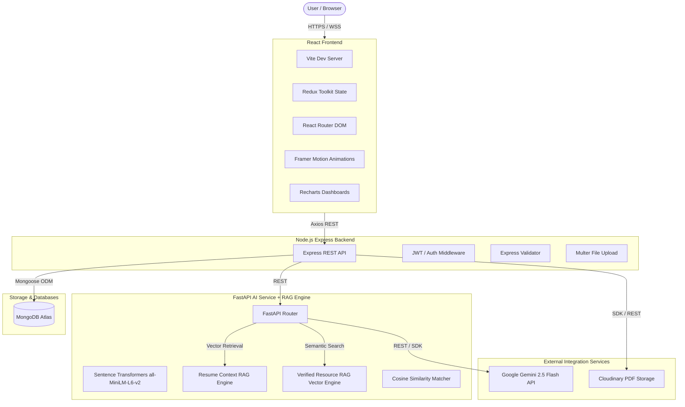

# AI Career Intelligence Platform

The **AI Career Intelligence Platform** is a production-ready, AI-powered SaaS application designed to help students and job seekers improve their employability. It offers intelligent resume analysis, custom ATS scoring, skill gap identification, interactive career roadmaps with verified learning resources via RAG, a contextual AI career mentor, and an interactive interview simulator.

---

## 🏗️ Architecture Diagram



---

## 🚀 Key Features

*   **Dual-Stream Retrieval-Augmented Generation (RAG)**:
    *   **Mentor Chatbot RAG**: Dynamically chunks and vectorizes candidate resume sections (Experience, Projects, Skills, Summary, Education), performing top-$K$ cosine similarity retrieval to ground AI Career Mentor answers specifically in the user's background.
    *   **Roadmap Resource RAG**: Pre-computes semantic vector embeddings across **13+ technical domains** (React, Next.js, Node.js, Python, MongoDB, SQL, Docker, Kubernetes, AWS, ML/AI, DSA, System Design, Git), replacing LLM hallucinations with verified documentation, top YouTube playlists, GitHub repos, and interactive practice platforms.
*   **Secure Authentication**: Role-Based Access Control (RBAC) supporting `Student`, `Recruiter`, and `Admin` roles with secure JWT + Refresh Token flows.
*   **Resume Upload & Management**: Drag & Drop PDF upload, Cloudinary integration, version history, and automated cleanup.
*   **Deterministic ATS Engine**: A local semantic matcher using `sentence-transformers` (`all-MiniLM-L6-v2`) and cosine similarity with weighted heuristic rule scoring (No LLM dependencies for ATS calculation).
*   **Automated Skill Gap Analysis**: High-speed gap identification comparing resume skill profiles against target Job Descriptions, classifying gaps by priority.
*   **AI Career Roadmap Generator**: Custom-tailored multi-week learning pathways powered by Gemini 2.5 Flash and enriched with verified resources via RAG.
*   **AI Interview Simulator**: HR, Technical, and Behavioral interview modules with question generation, voice/text answers, and detailed grading rubrics.
*   **High-Availability Gemini Service**: Automated multi-key rotation pool with exponential backoff and retries to ensure uninterrupted LLM operations.
*   **Analytics Dashboard**: Visual representations of ATS progress, skill profiles, and learning achievements via Recharts.

---

## 📂 Folder Structure

```
career-intelligence-platform/
├── frontend/                     # React Single Page App (Vite + Tailwind CSS)
│   ├── public/                   # Static public assets
│   └── src/
│       ├── assets/               # Styled assets, global styles, images
│       ├── components/           # Reusable UI elements (cards, loaders, buttons)
│       ├── hooks/                # Custom shared hooks (auth, theme)
│       ├── layouts/              # Core layout templates (DashboardLayout, AuthLayout)
│       ├── pages/                # App pages (Dashboard, ResumeManager, MentorChat, Roadmap)
│       ├── redux/                # Redux Toolkit slices and store configuration
│       ├── routes/               # Navigation routes and protected route definitions
│       ├── services/             # Axios API client handlers
│       └── utils/                # Helper functions and formatters
├── backend/                      # Node.js + Express API Backend
│   └── src/
│       ├── config/               # DB, Cloudinary, and package initializations
│       ├── controllers/          # Request handlers and business controller logic
│       ├── middlewares/          # Security, JWT auth verification, upload filters
│       ├── models/               # Mongoose schema definitions (Resume, CareerChat, Roadmap)
│       ├── repositories/         # Database access layer (Repository Pattern)
│       ├── routes/               # API endpoint routing
│       ├── services/             # Third-party integrations (Cloudinary, FastAPI Client)
│       ├── uploads/              # Temporary local multer buffer directory
│       ├── utils/                # Shared helper and utility scripts
│       └── validators/           # Express-validator validation schemas
├── ai-service/                   # FastAPI Semantic Engine & RAG Service
│   └── app/
│       ├── api/                  # FastAPI router and endpoints
│       ├── embeddings/           # Sentence Transformer loaders & TF-IDF fallback matcher
│       ├── nlp/                  # spaCy & vocabulary-based keyword extraction
│       ├── rag/                  # RAG Engines
│       │   ├── resume_rag.py     # Candidate resume chunking & context vector retrieval
│       │   └── resource_rag.py   # Verified learning resource semantic vector database
│       ├── schemas/              # Pydantic data schemas
│       ├── scoring/              # Heuristic/Cosine weighted ATS calculation & skill gaps
│       ├── services/             # Gemini 2.5 Flash service with key rotation pool
│       └── utils/                # PDF text extraction (PyMuPDF) and normalization
└── docs/                         # Architecture, schemas, and design documents
```

---

## 🛠️ Installation & Setup

### Prerequisites
- Node.js (v18+)
- Python 3.10+
- MongoDB instance (Local or Atlas)
- Accounts/API keys for: Cloudinary and Google Gemini.

### 1. Clone & Initialize Workspace
```bash
git clone https://github.com/Kajjayamadithya/Career-Intelligence-Resume-Optimization-Platform.git
cd Career-Intelligence-Resume-Optimization-Platform
```

### 2. AI Service Setup (Python FastAPI + RAG)
```bash
cd ai-service
python -m venv venv
venv\Scripts\activate            # On macOS/Linux: source venv/bin/activate
pip install -r requirements.txt
pip install https://github.com/explosion/spacy-models/releases/download/en_core_web_sm-3.7.1/en_core_web_sm-3.7.1-py3-none-any.whl
cp .env.example .env             # Fill in GEMINI_API_KEY / GEMINI_API_KEY1..6
python -m uvicorn app.main:app --reload --port 8000
```

### 3. Backend Setup (Node.js Express)
```bash
cd ../backend
npm install
cp .env.example .env             # Fill in MONGO_URI, JWT secrets, Cloudinary keys
npm run dev
```

### 4. Frontend Setup (React SPA)
```bash
cd ../frontend
npm install
cp .env.example .env             # VITE_API_URL=http://localhost:5000/api
npm run dev
```

---

## 🔒 Environment Variables

### Backend (`backend/.env`)
```env
PORT=5000
NODE_ENV=development
MONGO_URI=your_mongodb_atlas_connection_string
JWT_SECRET=your_jwt_access_token_secret
JWT_REFRESH_SECRET=your_jwt_refresh_token_secret
CLOUDINARY_CLOUD_NAME=your_cloudinary_cloud_name
CLOUDINARY_API_KEY=your_cloudinary_api_key
CLOUDINARY_API_SECRET=your_cloudinary_api_secret
AI_SERVICE_URL=http://127.0.0.1:8000
```

### AI Service (`ai-service/.env`)
```env
PORT=8000
GEMINI_API_KEY1=your_primary_gemini_key
GEMINI_API_KEY2=your_fallback_gemini_key_1
GEMINI_API_KEY3=your_fallback_gemini_key_2
```

### Frontend (`frontend/.env`)
```env
VITE_API_URL=http://localhost:5000/api
```

---

## 📡 API Reference Summary

### Authentication
- `POST /api/auth/register` - Create user account
- `POST /api/auth/login` - Authenticate user & receive JWT and Refresh Tokens
- `POST /api/auth/refresh-token` - Rotate and generate new access tokens
- `POST /api/auth/logout` - Revoke tokens & logout user

### Resume Management
- `POST /api/resume/upload` - Upload PDF resume (PyMuPDF + Gemini parsing, Cloudinary storage)
- `GET /api/resume/latest` - Fetch newest resume profile
- `GET /api/resume/history` - Fetch full resume version history
- `DELETE /api/resume/:id` - Delete resume version

### Custom ATS Engine & Skill Gap
- `POST /api/ats/calculate` - Run weighted semantic comparison against a Job Description
- `GET /api/ats/report/:id` - Get specific ATS report
- `POST /api/skills/analyze` - Detail missing skills and roadmap priority categories

### Career Roadmaps & Mentorship (RAG-Enabled)
- `POST /api/career/roadmap` - Generate personalized roadmap enriched with verified RAG learning resources
- `GET /api/career/history` - Retrieve previously generated roadmaps
- `POST /api/chat/message` - Contextual chat with AI Career Mentor grounded in user's resume chunks
- `GET /api/chat/history` - Fetch full conversation history
- `POST /api/rag/resources/search` - Direct semantic search across verified technology resource database

### Interview Simulator
- `POST /api/interview/start` - Initiate behavioral/technical/HR mock interview
- `POST /api/interview/answer` - Grade user answer
- `GET /api/interview/history` - Get history of simulated sessions
