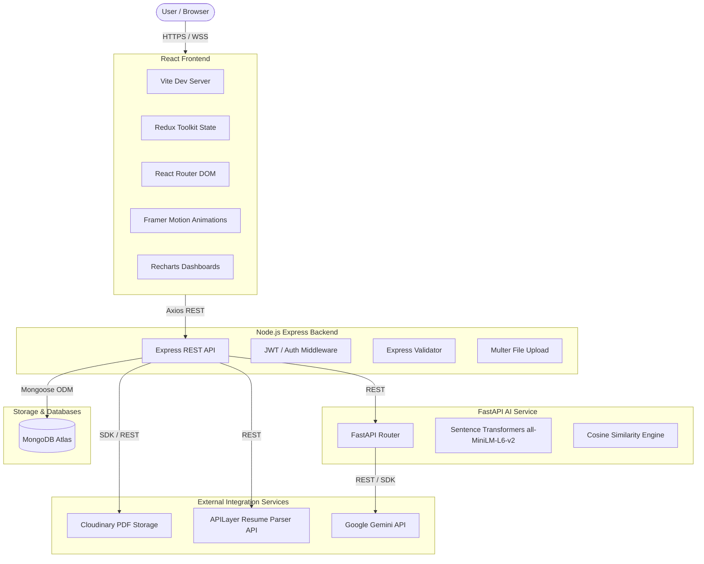

# AI Career Intelligence Platform

The **AI Career Intelligence Platform** is a production-ready, AI-powered SaaS application designed to help students improve their employability. It offers resume analysis, custom ATS scoring, skill gap analysis, interactive career roadmaps with curated learning resources, an AI career mentor, and an interactive interview simulator.

---

## 🏗️ Architecture Diagram



---

## 🚀 Key Features

*   **Secure Authentication**: Role-Based Access Control (RBAC) supporting `Student`, `Recruiter`, and `Admin` roles, with secure JWT + Refresh Token flows.
*   **Resume Upload & Management**: Drag & Drop upload with PDF validation, Cloudinary integration, replace/delete capabilities, and version history.
*   **APILayer Resume Parsing**: Precise data extraction mapping to Normalized data schemas and storing raw JSON payloads for offline reprocessing.
*   **Custom ATS Engine**: A local semantic matcher using `sentence-transformers` (`all-MiniLM-L6-v2`) and cosine similarity alongside weighted rule-based heuristic scoring (No LLM for ATS Calculation).
*   **Skill Gap Analysis**: Automated gap identification mapping resume skill sets against target Job Descriptions, classifying gaps by priority.
*   **AI Resume Improvement**: Generative feedback powered by Gemini to enhance summaries, achievement statements, and keywords.
*   **AI Career Roadmap & Resource Engine**: Custom-tailored learning pathways supplemented with structured, verified resources (Documentation, YouTube playlists, GitHub repos, and Projects).
*   **AI Interview Simulator**: HR, Technical, and Behavioral interview modules with question generation, voice/text answers, and detailed grading.
*   **AI Career Mentor**: Instant feedback chatbot maintaining stateful learning discussions and career guidance.
*   **Analytics Dashboard**: Visual representations of ATS progress, skill profiles, and learning achievements via Recharts.

---

## 📂 Folder Structure

```
career-intelligence-platform/
├── frontend/                     # React Single Page App
│   ├── public/                   # Static public assets
│   └── src/
│       ├── assets/               # Styled assets, global styles, images
│       ├── components/           # Reusable UI elements (cards, loaders, buttons)
│       ├── hooks/                # Custom shared hooks (auth, theme)
│       ├── layouts/              # Core layout templates (DashboardLayout, AuthLayout)
│       ├── pages/                # App pages (Home, Login, Dashboard, Simulator)
│       ├── redux/                # Redux Toolkit slices and store configuration
│       ├── routes/               # Navigation routes and protected route definitions
│       ├── services/             # Axios API client handlers
│       └── utils/                # Helper functions and formatters
├── backend/                      # Node.js + Express API Backend
│   └── src/
│       ├── config/               # DB, Cloudinary, and package initializations
│       ├── controllers/          # Request handlers and business controller logic
│       ├── middlewares/          # Security, auth verification, upload filters
│       ├── models/               # Mongoose schema definitions
│       ├── repositories/         # Database access layer (Repository Pattern)
│       ├── routes/               # API endpoint routing
│       ├── services/             # Third-party integrations (Cloudinary, APILayer)
│       ├── uploads/              # Temporary local multer buffer directory
│       ├── utils/                # Shared helper and utility scripts
│       └── validators/           # Express-validator validation schemas
├── ai-service/                   # FastAPI Semantic Engine
│   └── app/
│       ├── api/                  # FastAPI router and endpoints
│       ├── embeddings/           # Sentence Transformer loaders and embedding generation
│       ├── nlp/                  # spaCy-based keyword and structural parsing
│       ├── scoring/              # Heuristic/Cosine weighted ATS calculation
│       ├── services/             # Gemini API communication handlers
│       └── utils/                # Data normalization and mapping utilities
└── docs/                         # Architecture, schemas, and design documents
```

---

## 🛠️ Installation & Setup

### Prerequisites
- Node.js (v18+)
- Python 3.10+
- MongoDB instance (Local or Atlas)
- Accounts/API keys for: Cloudinary, APILayer, and Gemini.

### 1. Clone & Initialize Workspace
```bash
git clone <repository-url>
cd career-intelligence-platform
```

### 2. Backend Setup
```bash
cd backend
npm install
cp .env.example .env
# Fill in the environment variables in .env
npm run dev
```

### 3. AI Service Setup
```bash
cd ../ai-service
python -m venv venv
source venv/Scripts/activate  # On Windows: venv\Scripts\activate
pip install -r requirements.txt
python -m spacy download en_core_web_sm
cp .env.example .env
# Fill in the environment variables in .env
uvicorn app.main:app --reload --port 8000
```

### 4. Frontend Setup
```bash
cd ../frontend
npm install
cp .env.example .env
# Fill in the environment variables in .env
npm run dev
```

---

## 🔒 Environment Variables

### Backend (.env)
```env
PORT=5000
NODE_ENV=development
MONGO_URI=your_mongodb_atlas_connection_string
JWT_SECRET=your_jwt_access_token_secret
JWT_REFRESH_SECRET=your_jwt_refresh_token_secret
CLOUDINARY_CLOUD_NAME=your_cloudinary_cloud_name
CLOUDINARY_API_KEY=your_cloudinary_api_key
CLOUDINARY_API_SECRET=your_cloudinary_api_secret
APILAYER_API_KEY=your_apilayer_resume_parser_api_key
AI_SERVICE_URL=http://localhost:8000
```

### AI Service (.env)
```env
PORT=8000
GEMINI_API_KEY=your_gemini_api_key
```

### Frontend (.env)
```env
VITE_API_URL=http://localhost:5000/api
```

---

## 📡 API Reference Summary

### Authentication
- `POST /api/auth/register` - Create user account
- `POST /api/auth/login` - Authenticate user & receive JWT and Refresh Tokens
- `POST /api/auth/logout` - Revoke tokens & logout user

### Resume Management
- `POST /api/resume/upload` - Upload PDF resume (stores to Cloudinary, parses, analyzes)
- `GET /api/resume/latest` - Fetch newest resume profile
- `DELETE /api/resume/:id` - Delete resume version

### Custom ATS Engine & Skill Gap
- `POST /api/ats/calculate` - Run weighted comparison against a Job Description
- `GET /api/ats/report/:id` - Get specific ATS report
- `POST /api/skills/analyze` - Detail missing skills and roadmap priority categories

### Career Roadmaps & Mentorship
- `POST /api/career/roadmap` - Generate personalized roadmap + resources via Gemini
- `GET /api/career/history` - Retrieve previously generated roadmaps
- `POST /api/chat/message` - Send message to AI career mentor

### Interview Simulator
- `POST /api/interview/start` - Initiate behavioral/technical/HR mock interview
- `POST /api/interview/answer` - Grade user answer
- `GET /api/interview/history` - Get history of simulated sessions

---

## 🎨 UI Screenshots
*Placeholders for upcoming beautiful glassmorphism theme components:*
- `[Dashboard Desktop Mockup]`
- `[Resume Upload & ATS Feedback Widget]`
- `[AI Interactive Roadmap Timeline]`

---

## 🚀 Deployment Guide
Detailed deployment steps for AWS, Heroku, Vercel, and Render will be covered in later phases.
